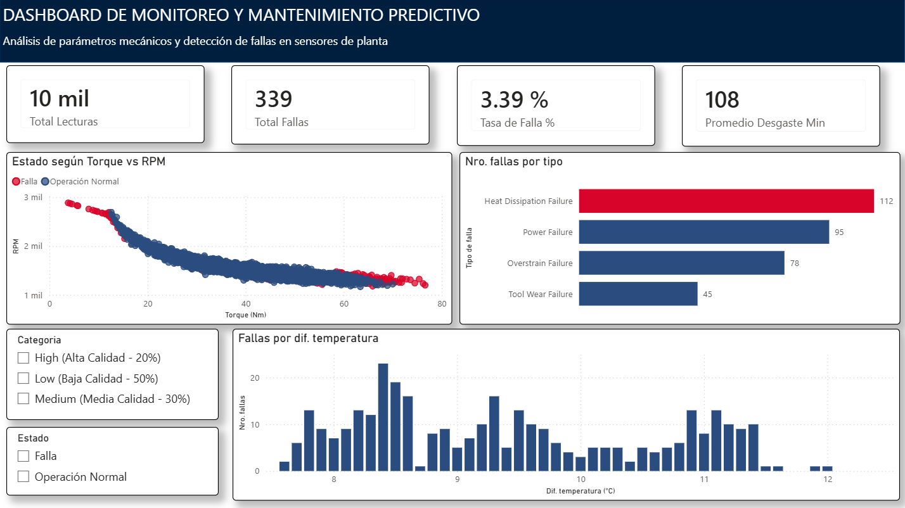

# 🛠️ Dashboard de Monitoreo y Mantenimiento Predictivo Industrial

## 📌 Descripción del Proyecto
Este proyecto simula un sistema de monitoreo en tiempo real para el área de mantenimiento de una planta industrial. El objetivo principal es transformar datos no estructurados de sensores mecánicos y térmicos en métricas de negocio accionables, permitiendo a los ingenieros y jefes de planta anticipar fallas críticas antes de que generen paradas no programadas en la producción.

---

## 🏗️ Arquitectura de la Solución
1. **Source Data:** Dataset sintético de telemetría e inspección de sensores de maquinaria industrial (Kaggle).
2. **Database & ETL (MySQL):** 
   - Creación de esquema y tablas estructuradas.
   - Limpieza de datos y feature engineering mediante la vista SQL `vw_lecturas_procesadas`.
   - Conversión de unidades de temperatura (Kelvin a Celsius) y cálculo del diferencial térmico ($T_{proceso} - T_{ambiente}$).
3. **Business Logic & Modeling (Power BI & DAX):**
   - Conexión e importación desde MySQL.
   - Creación de métricas clave (Total de Fallas, Tasa de Falla %, Desgaste Promedio de Herramientas).
4. **Data Visualization (UX/UI):**
   - Formato condicional enfocado en la causa raíz principal (*Heat Dissipation Failure*).
   - Análisis de dispersión de variables físicas (Torque vs. RPM) para la delimitación de zonas operativas de riesgo.

---

## 🛠️ Tecnologías Utilizadas
- **SQL (MySQL Workbench):** Creación de base de datos, Vistas (`CREATE VIEW`), agregaciones y consultas analíticas exploratorias.
- **Power BI Desktop:** Modelado de datos, lenguaje DAX, diseño de interfaz y storytelling con datos.

---

## 📊 Principales Insights del Análisis
- **Causa Raíz Principal:** La mayor concentración de fallas se debe a problemas de *Dissipation Heat Failure* (disipación de calor), directamente correlacionadas con un diferencial térmico superior a los 10 °C.
- **Zona de Riesgo Mecánico:** El análisis de dispersión reveló que los eventos de falla por sobrecarga ocurren de manera predominante cuando el Torque supera los 60 Nm y las RPM caen por debajo de las 1,300 RPM.
- **Monitoreo de Desgaste:** El promedio de uso acumulado de la herramienta (*Tool Wear*) en máquinas falladas fue significativamente mayor respecto al grupo operativo normal, permitiendo establecer un umbral preventivo a los 180 minutos de uso.

---

## 🚀 Cómo ejecutar este proyecto

1. **Clonar o descargar el repositorio:** 
   Descarga los archivos del proyecto (incluyendo `predictive_maintenance.csv` y el script `create_database_tabla_sensores.sql`).
2. **Configurar la Base de Datos en MySQL:**
   - Abre **MySQL Workbench** y ejecuta el script `create_database_tabla_sensores.sql` para crear la base de datos `mantenimiento_predictivo` y la tabla `lecturas_sensores`.
   - Importa los datos del archivo `predictive_maintenance.csv` a la tabla `lecturas_sensores` usando el **Table Data Import Wizard** de MySQL Workbench.
   - Ejecuta el script `vw_lecturas_procesadas.sql` para crear la vista `vw_lecturas_procesadas`.
3. **Visualizar el Dashboard en Power BI:**
   - Abre el archivo `dashboard_sensores.pbix` en Power BI Desktop.
   - Si se te solicita, actualiza la credencial/conexión a tu servidor local de MySQL (`localhost`).

